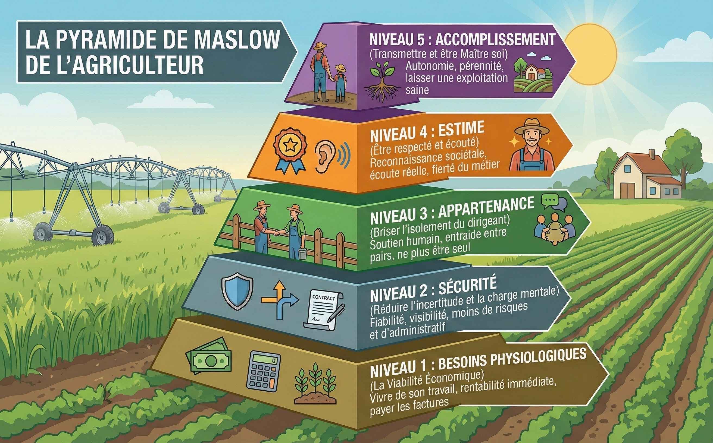
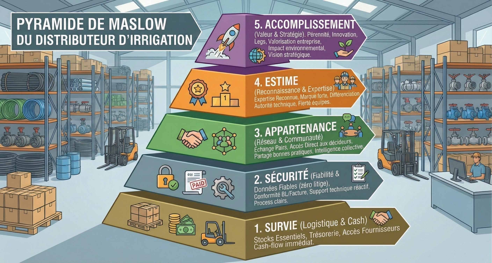
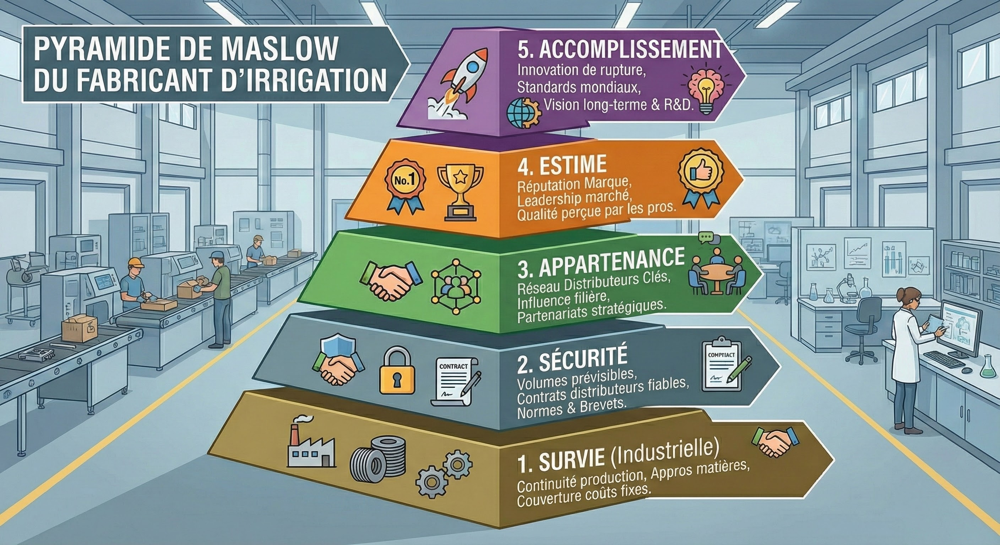

# D'où viennent les frises et les personas

Ce document retrace ce que les modules `cultiveau_persona` et `cultiveau_frise` mettent en code, à partir des
documents de travail du réseau (dossier Drive « frises et personas ») : les Journées Cultiveau 2025, l'étude PRISM 2023,
le baromètre VoxAgri 2025, le Plan eau de mars 2023 et les trois pyramides de Maslow de la filière.

## 1. Le point de départ : la peur du manque

Neuf mois d'étude du marché (2025) ont donné le constat qui ouvre les Journées Cultiveau :

| Repère | Valeur | Source |
|---|---|---|
| Taille du marché de l'irrigation | 400 M€ | Journées Cultiveau 2025 |
| Exploitations en moins en dix ans | −30 % | idem |
| Surface moyenne par ferme | +20 % | idem |
| Exploitants qui ne prévoient aucun investissement dans les deux ans | 51 % | VoxAgri 2025 |
| Agriculteurs qui se disent « désespérés » | 20 % (5 % en 1998) | VoxAgri 2025 |
| Agriculteurs qui pensent que leur situation financière va s'améliorer | 13 % | VoxAgri 2025 |

« Le client ne cherche plus à être convaincu. Il cherche à être compris. » Le problème n'est pas la demande, c'est la peur
de se tromper : peur de manquer de clients, de marge, de trésorerie, de croissance. Elle produit des comportements
défensifs (surstockage, guerre des prix, repli sur le court terme, perte de confiance entre acteurs). Ce que le réseau
veut reconstruire, c'est la confiance.

## 2. La vente agricole, c'est trois choses

L'atelier 1 des Journées (« Échanger sur nos pratiques commerciales ») part de ce que les commerciaux font déjà au feeling :
adapter leur discours au client, éviter de contacter au mauvais moment, sentir quand le client est réceptif, parler
différemment selon le contexte économique. La vente agricole croise trois dimensions :

1. **le client** : chaque agriculteur est différent (personnalité, ambitions, freins) → les **personas** ;
2. **le timing** : chaque culture a son rythme (semis, floraison, récolte, bilan) → les **frises culturales** ;
3. **le contexte** : les cours agricoles influencent la confiance et l'investissement → les **cours**.

Le feeling se transmet mal, se reproduit mal et fait rater des occasions. L'enjeu est de passer du feeling à la méthode :
« ce que vous faites au feeling, je l'ai juste structuré ; je ne réinvente rien, je documente ce qui marche. » D'où les
quatre piliers : les personas, les frises, les cours, et **l'Agent** qui les croise.

## 3. Pilier 1 : les cinq personas agricoles (étude PRISM 2023)

L'étude PRISM (BVA, Réussir, Agriconomie ; enquête en ligne de vingt minutes auprès de 1 766 chefs d'exploitation et
co-exploitants, échantillon national représentatif, décembre 2022 à janvier 2023) dégage cinq groupes comportementaux.
Les Journées Cultiveau leur ont donné un animal.

| Persona | L'étude | Comment l'aborder (Journées 2025) | Besoin dominant (Maslow agriculteur) |
|---|---|---|---|
| 🦁 **Lion**, le leader | Grandes exploitations (188 ha), associés, salariés, CA élevé, 40-49 ans, diplômés ; optimistes, projets d'agrandissement et de modernisation ; les seuls à préférer maximiser la productivité ; 60 % « mes collègues me demandent conseil » ; presse spécialisée, salons | Résultats et innovation ; direct et efficace ; des solutions qui le démarquent ; éviter les détails techniques inutiles | 4. Estime |
| 🐆 **Jaguar**, l'opportuniste | Plus jeunes (28 % < 39 ans), diplômés, 142 ha ; recherche d'autonomie ; 63 % engagés (31 % HVE, 26 % bio), les plus diversifiés ; 9/10 formés ; cherchent le meilleur produit quitte à y passer du temps ; 71 % Internet, tutos | Le retour sur investissement chiffré, le comparatif, la transparence ; le meilleur deal | 5. Accomplissement (autonomie, pérennité) |
| 🐈 **Chat**, le routinier | 50-59 ans, 128 ha, individuels, sans salarié, CA inférieur ; majorité d'éleveurs ; pessimistes, peu ouverts à l'accompagnement ; se débrouillent seuls ; reprennent les produits qui ont fait leurs preuves ; e-commerce, forums | Fiabilité ; preuves et témoignages ; patience, ne pas forcer ; un essai ou une garantie | 1. Viabilité économique |
| 🐢 **Tortue**, le fidèle | > 50 ans, 120 ha, traditionnels, délégateurs ; s'appuient sur les techniciens des fournisseurs, se disent fidèles, veulent un suivi régulier ; choisissent dans la liste du technicien ; peu Internet | La relation longue, le même interlocuteur, le conseil ; l'accompagnement | 2. Sécurité |
| 🐝 **Abeille**, le collaboratif | 50-59 ans, 172 ha, associés, salariés, diversifiés ; 80 % engagés (47 % HVE) ; aiment apprendre avec les autres (87 % formés), clubs de la chambre, salons, revues ; relation partenariale ; le groupe qui pèse le plus en chiffre d'affaires | Sens et impact ; transparence ; expliquer la démarche, pas seulement le produit ; valoriser le durable | 3. Appartenance |

Dans le module, chaque persona porte ces quatre colonnes (`profil`, `approche`, `arguments`, `maslow`) plus les signes
pour le reconnaître, le canal, le moment et les pièges. Le questionnaire de huit questions reprend les questions de
l'étude qui séparent le mieux les groupes : le réflexe face à un problème technique (« question très discriminante »
dans l'étude : dialoguer, se débrouiller, chercher l'information), l'achat courant (mêmes produits, meilleur produit,
liste du technicien), la relation attendue du fournisseur, productivité ou charges, l'état d'esprit, l'engagement et la
diversification, le rapport à la technologie, les sources d'information. En cas d'égalité, le profil prudent l'emporte :
une approche rassurante ne coûte rien, une approche ambitieuse mal placée coûte le client.

L'exercice des Journées reste valable dans l'ERP : « pensez à trois de vos clients ; quel animal leur correspond ?
Adaptez-vous déjà votre discours sans le savoir ? »

## 4. Pilier 2 : les frises culturales et les quatre saisons émotionnelles

Le livrable demandé aux adhérents pendant l'atelier était « une frise simple d'une culture que vous connaissez bien,
avec les bons et mauvais moments pour contacter ». La frise de référence du Gard (quatorze cultures, stades, Kc,
besoins en eau, fenêtres projet et achat) en est l'aboutissement ; elle est livrée dans `cultiveau_frise`.

Les Journées y ajoutent une lecture émotionnelle, les **quatre saisons** :

| Saison | Posture | Ce que l'agriculteur attend |
|---|---|---|
| ❄ Hiver | **Écoute** | Il a le temps et il réfléchit : écouter, comprendre, étudier (analyse des besoins, bilan, visite) |
| 🌱 Printemps | **Support** | Il met en route : être là, remettre en service, régler, livrer ; pas de nouveau projet |
| ☀ Été | **Discret** | Plein travail, stress : ne pas solliciter ; répondre vite à l'urgence qu'il signale lui-même |
| 🍂 Automne | **Proposition** | Après récolte, bilan de campagne : le moment de proposer, chiffrer, planifier |

et la règle des **périodes de stress** : ne pas contacter pendant les semis, la floraison, les vendanges ou les autres
moments critiques. Dans le module, chaque stade porte sa posture (calculée depuis le calendrier et le besoin en eau,
modifiable) et un indicateur « période critique » détecté d'après le nom du stade (semis, plantation, floraison,
récolte, vendanges, fauche). La fiche de l'agriculteur combine ses cultures : une période critique l'emporte (discret),
sinon une fenêtre qui s'ouvre (proposition), puis l'écoute, puis le support. L'activité mensuelle « fenêtre » prévient
quand une culture est en période critique.

## 5. Pilier 3 : les cours agricoles

« Le contexte économique change la psychologie du client. Adaptez votre discours en conséquence. »

- **Cours en baisse** : parler sécurité et retour sur investissement ; rassurer sur la rentabilité à long terme ;
  insister sur les économies d'eau et la réduction des coûts ; proposer des solutions de financement ; fiabilité et
  durabilité.
- **Cours en hausse** : parler innovation et ambition ; solutions premium ; performance, rendement, optimisation ;
  technologies de pointe ; encourager l'investissement.

Dans le module, chaque culture porte une tendance (hausse, stable, baisse), un repère et une date de relevé ; la fiche
de l'agriculteur retient la tendance la plus prudente de ses cultures.

## 6. Pilier 4 : l'Agent

« L'IA ne remplace pas le commercial. Elle l'augmente. » L'Agent identifie le persona, alerte sur la frise, suit les
cours et recommande timing et ton. L'exemple des Journées : « client viticulteur, profil Chat (prudent), période
post-vendanges, cours du vin en baisse → attendre deux semaines (fin de stress vendanges), approche rassurante,
insister sur la fiabilité et les témoignages, éviter de parler prix tout de suite. »

C'est ce que fait `cultiveau_persona/models/agent.py` : à partir du persona, de la situation du mois (posture, cultures
critiques) et des cours, il produit « quand », « le ton », « l'approche » et « à éviter ». La recommandation s'affiche
sur la fiche de l'agriculteur (onglet Persona, encadré « L'Agent — ce mois-ci ») et part dans l'API de l'assistant
téléphonique (`agent` dans la fiche client) ; l'assistant la reçoit avant de décrocher et adapte son ton sans jamais la
lire à l'appelant. Le test `test_agent_exemple_des_journees` rejoue l'exemple du deck.

## 7. Les trois pyramides de Maslow de la filière

Trois pyramides (agriculteur, distributeur d'irrigation, fabricant d'irrigation) décrivent les besoins de chaque
acteur, du plus vital au plus élevé. Elles donnent le « pourquoi » des personas (le besoin dominant que chacun cherche
à satisfaire) et le programme de l'ERP pour les adhérents.

**Agriculteur** : 1. besoins physiologiques, la viabilité économique (vivre de son travail, rentabilité immédiate, payer
les factures) ; 2. sécurité (réduire l'incertitude et la charge mentale : fiabilité, visibilité, moins de risques et
d'administratif) ; 3. appartenance (briser l'isolement du dirigeant : soutien humain, entraide entre pairs) ;
4. estime (être respecté et écouté : reconnaissance, écoute réelle, fierté du métier) ; 5. accomplissement (transmettre
et être maître de soi : autonomie, pérennité, laisser une exploitation saine).

**Distributeur** : 1. survie (logistique et cash : stocks essentiels, trésorerie, accès fournisseurs) ; 2. sécurité
(fiabilité et données fiables, zéro litige, conformité BL/facture, support technique réactif, process clairs) ;
3. appartenance (réseau et communauté : échange entre pairs, accès direct aux décideurs, bonnes pratiques) ; 4. estime
(expertise reconnue, marque forte, autorité technique, fierté des équipes) ; 5. accomplissement (pérennité, innovation,
valorisation de l'entreprise, impact environnemental, vision).

**Fabricant** : 1. survie industrielle (continuité de production, approvisionnements, couverture des coûts fixes) ;
2. sécurité (volumes prévisibles, distributeurs fiables, normes et brevets) ; 3. appartenance (réseau de distributeurs
clés, influence filière, partenariats) ; 4. estime (réputation, leadership, qualité perçue par les pros) ;
5. accomplissement (innovation de rupture, standards mondiaux, R&D).

Ce que l'ERP sert sur la pyramide du distributeur : les niveaux 1 et 2 avec Odoo (stocks, achats, devis, factures,
comptabilité française, BL conformes) et les modules installation et interventions (process clairs, registre, PV) ;
le niveau 3 avec le réseau dans le menu (adhérents, outils communs, catalogue partagé) ; le niveau 4 avec le dossier
technique du référentiel (A1.1 à A1.5) qui fait du distributeur une autorité technique auprès de l'agriculteur.

## 8. Ce que les ateliers suivants ajoutent

- **Atelier 2, le SAV** : quatre niveaux de maturité (mal nécessaire, pompier, support, partenaire) et un processus en
  cinq étapes (réception, diagnostic, planification, intervention, suivi) ; la transparence totale (délais réalistes,
  coûts détaillés, difficultés anticipées : « −80 % de litiges sur les factures ») ; le petit plus (appel de suivi à
  48 h, diagnostic complémentaire) et la personnalisation (technicien attitré). C'est le module `cultiveau_interventions`
  (étapes, urgence, pièces → devis, registre) et le persona (technicien attitré pour la Tortue).
- **Atelier 3, la valeur ajoutée** : valeur réelle, perçue, partagée ; cinq piliers (compétence, réactivité,
  communication, fiabilité, relation humaine) ; identifier, clarifier (du jargon au langage client), prouver, ritualiser
  (appel de confirmation, photo avant/après, remerciement, rappel de maintenance), mesurer (NPS). Les rituels sont les
  activités planifiées de l'ERP (fenêtres, rappels saisonniers, suivi après intervention).
- **Atelier 4, l'entraide** : Cultiplus (partage de techniciens), Main dans la main (hotline dirigeants), Cultisavoir
  (capsules de formation entre pairs).
- **Atelier 5, l'irrigation à l'usage** : du CAPEX (50 à 60 k€ pour une station, trésorerie immobilisée, mensualités
  rigides en année pluvieuse, valeur résiduelle 40 % à 7-10 ans) à l'OPEX : un prix au m³ tout inclus (investissement,
  maintenance, SAV, IoT), un volume cible agronomique (ETP × Kc × frise culturale × sol), une mensualité lissée, une
  bande de flexibilité 90–110 %, un transfert ou un renouvellement en fin de contrat. Exemple du deck : maïs 30 ha,
  50 000 € d'investissement, intérêts 3,25 %, 5 000 € de maintenance, 900 000 m³ sur dix ans → 0,073 €/m³, 0,081 €/m³
  avec 10 % de marge, environ 600 €/mois. Le simulateur « irrigation à l'usage » de `cultiveau_ventes` reprend ce calcul
  depuis une installation ou un devis.

## Sources

- Journées Cultiveau 2025, « Les journées des collections & solutions : ce que nous allons construire ensemble » (deck, 101 pages).
- Étude PRISM 2023, « Comprendre des agriculteurs d'aujourd'hui et de demain », BVA / Réussir / Agriconomie.
- VoxAgri, vague 1, 29 septembre 2025 (baromètre du moral agricole).
- Plan d'action pour une gestion résiliente et concertée de l'eau, mars 2023 (53 mesures).
- Pyramides de Maslow de l'agriculteur, du distributeur et du fabricant d'irrigation (Cultiveau, 2025).
- Frise culturale de référence du Gard, « exemple frise culturale 30 » (Cultiveau, février 2025).
